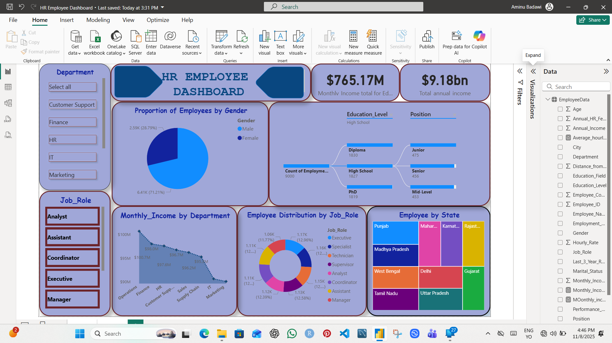
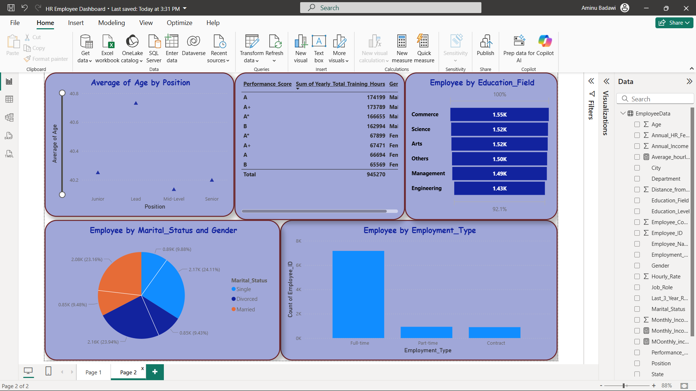

# 📊 Power BI HR Employee Analytics Dashboard

## 🏷️ Project Title
**Employee Performance and Cost Insights Dashboard**

---

## 🧠 Overview
This Power BI dashboard provides **interactive visual insights** into the employee management — tracking performance, efficiency, and analytics.  
It complements the **Excel VBA Search Automation System**, transforming operational data into strategic business intelligence.

---

## 🎯 Objectives
- Visualize performance trends and demographic distribution.
- Track departmental performance metrics and leadership metrics.
- Automate data updates from Excel (linked with VBA system).

---

## 🧩 Dataset Description
The dataset used contains columns such as:

| Column Name | Description |
|--------------|--------------|
| employee_id | employee_name |
| city | Ndepartment |
| Category | Position |
| Quantity | Number of items available |
| Unit Price | Cost per item |
| Supplier | Vendor providing the product |
| Reorder Level | Threshold for restocking alerts |
| Date Added | Date the item entered the system |

---

## 📈 Dashboard Pages & Features

### 1️⃣ Overview Page
- employee_id, employee_name, and demographic breakdown.  
- 9000 rows of data entries.

### 2️⃣ performance & Insights
- Visualize performance by categories type.  
- Detect high-performing vs low-performing categories.

---

## ⚙️ Tools & Technologies
- **Microsoft Power BI**
- **Excel (as data source)**
- **Power Query**
- **DAX Expressions**

---

## 🧭 How to Use
1. Download `Inventory_Dashboard.pbix`.
2. Open it using **Power BI Desktop**.
3. Update the **Excel data source path** to your local file.
4. Click **Refresh** to pull new data from the VBA system.
5. Interact using slicers, charts, and filters.

---

## 🖼️ Embedding Screenshots & Demos

---

---

## 🔗 Related Project
**[Excel VBA Inventory Automation System](https://github.com/E-badawy/Excel-Employee-Search-VBA)**

---

## 👨‍💻 Author
**Badawi Aminu Muhammed**  
Researcher Scientist | Data Analyst | M & E specialist 
📧 cigma.generalsolutions@gmail.com  
🔗 [LinkedIn](https://linkedin.com/in/elameenbadawy)

---

## 📜 License
This project is released under the **MIT License**.
